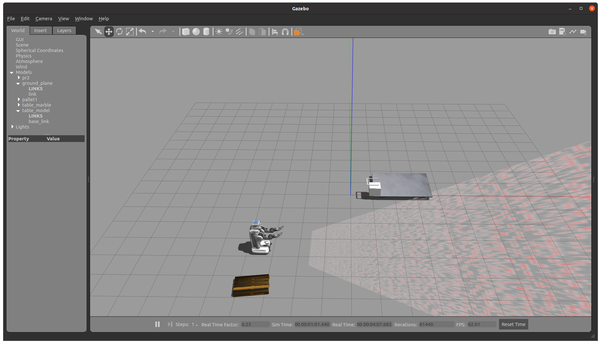

<p align="center">
  <h2 align="center">Pr2 Pick and Place Simulation in Ros/Gazebo</h2>
</p>



### How to run?
```
cd to src and build with catkin build
roslaunch pr2_gazebo pr2_test.launch
--manually move the robot from 0,0 to 4,4 see the picture for information 
roslaunch pr2_gazebo test.launch
--add the table marble as shown in the picture and then place the box model on top of that
roslaunch pr2_arm_kinematics  pr2_ik_rarm_node.launch
roslaunch pr2_arm_kinematics  pr2_ik_larm_node.launch
cd catkin_ws/src/ik_trajectory_tutorial/bin/
./ik_trajectory_tutorial
cd catkin_ws/src/action_pr2/bin/
./action_pr2
```
### Troubleshoot
```
If you find issues while building using make or catkin build then set the ros package path variable as shown below

export ROS_PACKAGE_PATH=/home/sujee/catkin_ws/src/arm_navigation_msgs:/home/sujee/catkin_ws/src/ros_control/controller_manager_msgs:/home/sujee/catkin_ws/src/convex_decomposition:/home/sujee/catkin_ws/src/gazebo_ros_pkgs/gazebo_dev:/home/sujee/catkin_ws/src/gazebo_ros_pkgs/gazebo_msgs:/home/sujee/catkin_ws/src/gazebo_ros_pkgs/gazebo_ros:/home/sujee/catkin_ws/src/gazebo_ros_pkgs/gazebo_plugins:/home/sujee/catkin_ws/src/gazebo_ros_pkgs/gazebo_ros_pkgs:/home/sujee/catkin_ws/src/ros_control/hardware_interface:/home/sujee/catkin_ws/src/ros_control/combined_robot_hw:/home/sujee/catkin_ws/src/ros_control/controller_interface:/home/sujee/catkin_ws/src/ros_control/controller_manager:/home/sujee/catkin_ws/src/ros_control/controller_manager_tests:/home/sujee/catkin_ws/src/ros_control/combined_robot_hw_tests:/home/sujee/catkin_ws/src/ivcon:/home/sujee/catkin_ws/src/ros_control/joint_limits_interface:/home/sujee/catkin_ws/src/kinematics_msgs:/home/sujee/catkin_ws/src/pr2_kinematics/pr2_arm_kinematics:/home/sujee/catkin_ws/src/pr2_common/pr2_common:/home/sujee/catkin_ws/src/pr2_simulator/pr2_controller_configuration_gazebo:/home/sujee/catkin_ws/src/pr2_common/pr2_dashboard_aggregator:/home/sujee/catkin_ws/src/pr2_common/pr2_description:/home/sujee/catkin_ws/src/pr2_mechanism/pr2_hardware_interface:/home/sujee/catkin_ws/src/pr2_kinematics/pr2_kinematics:/home/sujee/catkin_ws/src/pr2_common/pr2_machine:/home/sujee/catkin_ws/src/pr2_mechanism/pr2_mechanism:/home/sujee/catkin_ws/src/pr2_mechanism/pr2_mechanism_model:/home/sujee/catkin_ws/src/pr2_mechanism/pr2_controller_interface:/home/sujee/catkin_ws/src/pr2_mechanism_msgs:/home/sujee/catkin_ws/src/pr2_mechanism/pr2_mechanism_diagnostics:/home/sujee/catkin_ws/src/pr2_mechanism/pr2_controller_manager:/home/sujee/catkin_ws/src/pr2_common/pr2_msgs:/home/sujee/catkin_ws/src/pr2_simulator/pr2_gazebo_plugins:/home/sujee/catkin_ws/src/pr2_simulator/pr2_gazebo:/home/sujee/catkin_ws/src/pr2_simulator/pr2_simulator:/home/sujee/catkin_ws/src/robot_pose_ekf:/home/sujee/catkin_ws/src/ros_control/ros_control:/home/sujee/catkin_ws/src/ros_control/rqt_controller_manager:/home/sujee/catkin_ws/src/ros_control/transmission_interface:/home/sujee/catkin_ws/src/gazebo_ros_pkgs/gazebo_ros_control:/home/sujee/ws_moveit/src/moveit_tutorials:/home/sujee/ws_moveit/src/panda_moveit_config:/opt/ros/noetic/share:/home/sujee/catkin_ws/src/ik_trajectory_tutorial:/home/sujee/catkin_ws/src/simple_gripper:/home/sujee/catkin_ws/src/pr2_moveit_config:/home/sujee/catkin_ws/src/drive_base_tutorial:/home/sujee/catkin_ws/src/action_pr2:/home/sujee/catkin_ws/src/euro_pallet

Paste the command in bashrc file if you get python 2 and python 3 version conflict
sudo ln -sf /usr/bin/python3 /usr/local/bin/python
```
<p align="center">
  <h2 align="center">UR5 Pick and Place Simulation in Ros/Gazebo</h2>

  
</p>
<br>


## Table of contents
- [Description](#description)
- [Requirement](#requirements)
- [Folder](#folder)
- [Setup](#setup)
- [Usage](#usage)
- [Contributors](#contributors)

### Description
This repository demonstrates UR5 pick-and-place in ROS and Gazebo. The UR5 uses a Xbox Kinect cam to detect eleven types of Lego Bricks, and publish its position and angolation. 

The goals of this project are:
- simulate the iteration of a UR5 robot with Lego bricks
- The robotic arm must be able to move a block from position A to B and construct a castle by assembling different bricks


### Folder
```
UR5-Pick-and-Place-Simulation/catkin_ws/
├── levelManager
├── vision
├── motion_planning
├── gazebo_ros_link_attacher
├── robot
```
- `levelManager:` the task of this package is to launch the world and spawn the different bricks
- `vision:` the task of this package is to recognize the object type and orientation of the bricks
- `motion_planning:` the task is to move the robot and pick and place the lego
- `gazebo_ros_link_attacher:` A gazebo plugin definable from URDF to inform a client of a collision with an object
- `robot:` the task is to define the robot model with appropriate PID settings


### Requirements

For running each sample code:
- `Ros Noetic:` http://wiki.ros.org/noetic/Installation
- `Gazebo:` https://classic.gazebosim.org/tutorials?tut=ros_installing&cat=connect_ros
- `Yolov5` https://github.com/ultralytics/yolov5
- `Catkin` https://catkin-tools.readthedocs.io/en/latest/

### Setup

After installing the libraries needed to run the project. Clone this repo:
```
git clone https://github.com/pietrolechthaler/UR5-Pick-and-Place-Simulation/
```

Setup the project:
```
cd UR5-Pick-and-Place-Simulation/catkin_ws
source /opt/ros/noetic/setup.bash
catkin build
source devel/setup.bash
echo "source $PWD/devel/setup.bash" >> $HOME/.bashrc
```

Clone and install [YoloV5](https://github.com/ultralytics/yolov5):
```
cd ~
git clone https://github.com/ultralytics/yolov5
cd yolov5
pip3 install -r requirements.txt
```
### Usage

Launch the world
```
roslaunch levelManager lego_world.launch
```
Choose the level (from 1 to 4):
```
rosrun levelManager levelManager.py -l [level]
```
Start the kinematics process
```
rosrun motion_planning motion_planning.py
```
Start the localization process
```
rosrun vision vision.py -show
```
- `-show` : show the results of the recognition and localization process with an image

### Contributors

| Name                 | Github                               |
|----------------------|--------------------------------------|
| Davice Cerpelloni    | https://github.com/davidecerpelloni  |
| Leonardo Collizzolli | https://github.com/leocolliz         |
| Pietro Lechthaler    | https://github.com/pietrolechthaler  |
| Stefano Rizzi        | https://github.com/StefanoRizzi      |
